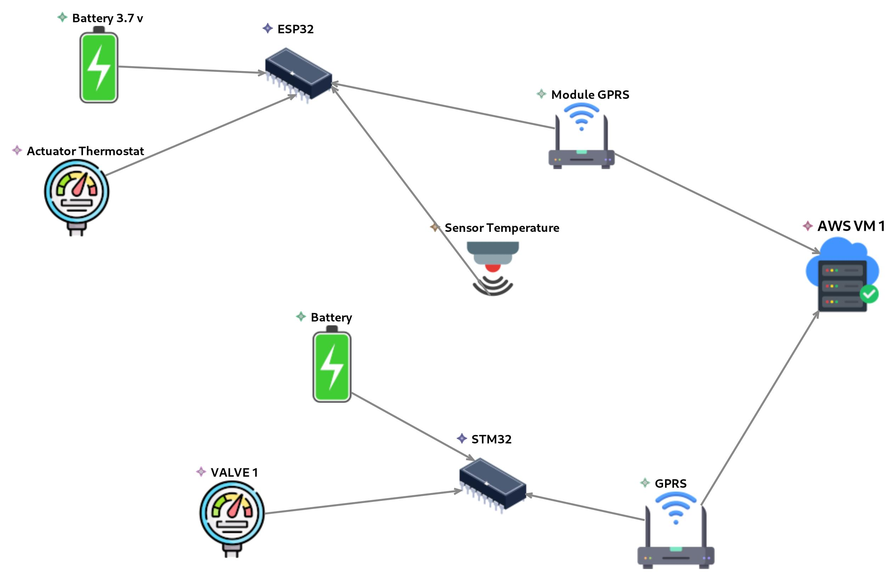

# IoT Sensor Network - Model-Driven Engineering

This project demonstrates a complete **Model-Driven Engineering (MDE)** pipeline for IoT Sensor Network Managment:

1. **Metamodel Definition** - Ecore metamodel defining IoT concepts
2. **Visual Modeling** - Sirius graphical editor for creating IoT configurations
3. **Code Generation** - Acceleo templates generating PostgreSQL schemas
4. **RESTful API** - Node.js/Express API with CRUD operations
5. **Containerization** - Docker Compose for easy deployment


- [IoT Sensor Network - Model-Driven Engineering](#iot-sensor-network---model-driven-engineering)
  - [Metamodel (M2)](#metamodel-m2)
  - [Sirius Graphical Modeling](#sirius-graphical-modeling)
  - [Acceleo Code Generation](#acceleo-code-generation)
    - [Generated Artifacts](#generated-artifacts)
  - [RESTful API](#restful-api)
    - [API Endpoints](#api-endpoints)
      - [Sensor Nodes](#sensor-nodes)
      - [Modules](#modules)
      - [How to Use](#how-to-use)


## Metamodel (M2)

The metamodel defines the core concepts and relationships for modeling IoT Sensor Network Mangment.

")
** Figure 1: Meta-Model (M2) for IoT Sensor Network Mangment **

## Sirius Graphical Modeling
Sirius provides a visual modeling environment for creating IoT sensor network configurations.


** Figure 2: Sirius Diagram for Meta-Model (M2)**

## Acceleo Code Generation
Acceleo transforms IoT models into production-ready code.

### Generated Artifacts

| Artifact | Description | Output |
|----------|-------------|--------|
| **PostgreSQL Schema** | Complete database DDL | `.sql` files |


## RESTful API

| Artifact | Description | Output |
|----------|-------------|--------|
| **REST API** | Node.js/Express | CRUD operations |
| **Database** | PostgreSQL | Data persistence |
| **Containerization** | Docker | Deployment |

### API Endpoints

#### Sensor Nodes

| Method | Endpoint | Description |
|--------|----------|-------------|
| `GET` | `/api/v1/nodes` | Get all sensor nodes |
| `GET` | `/api/v1/nodes/:id` | Get node by ID |
| `GET` | `/api/v1/nodes/name/:name` | Get node by name |
| `GET` | `/api/v1/nodes/summary/:name` | Get node summary |
| `POST` | `/api/v1/nodes` | Create sensor node |
| `PUT` | `/api/v1/nodes/:id` | Update sensor node |
| `DELETE` | `/api/v1/nodes/:id` | Delete sensor node |

#### Modules

| Entity | Endpoint Pattern |
|--------|------------------|
| **Sensors** | `/api/v1/sensors` |
| **Actuators** | `/api/v1/actuators` |
| **Microcontrollers** | `/api/v1/microcontrollers` |
| **Communications** | `/api/v1/communications` |
| **Powers** | `/api/v1/powers` |
| **Servers** | `/api/v1/servers` |

#### How to Use

```sh
git clone https://github.com/mehradi-github/ref-model-driven.git
cd ./ref-model-driven/api

docker-compose up --build -d


#Base URL: http://localhost:3000/api/v1

#examples:

#Sensor Nodes
curl -X GET http://localhost:3000/api/v1/nodes

#POST /nodes
curl -X POST http://localhost:3000/api/v1/nodes \
  -H "Content-Type: application/json" \
  -d '{
    "name": "Factory_Sensor_02",
    "samplingRate": 500,
    "location": "Factory B, Line 2"
  }'

 #PUT /nodes/:id
 curl -X PUT http://localhost:3000/api/v1/nodes/1 \
  -H "Content-Type: application/json" \
  -d '{
    "samplingRate": 2000,
    "location": "Greenhouse A, Row 4"
  }'

  #DELETE /nodes/:id
  curl -X DELETE http://localhost:3000/api/v1/nodes/1


```